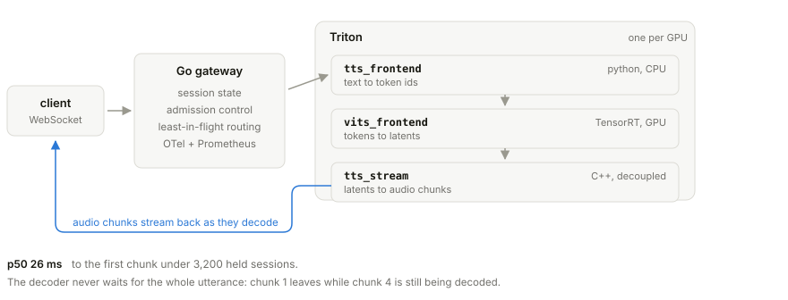
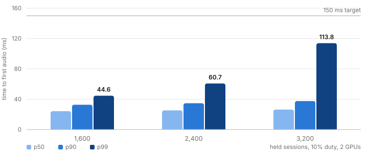

# streaming-tts-serving

Text-to-speech that starts talking in 26 milliseconds instead of waiting for the whole
sentence to render. VITS, chunked through a decoupled Triton backend written in C++, with
TensorRT FP16 engines under it and a Go gateway holding the sockets.

I gave myself one target: first audio out in under 150 ms at p99, with enough sessions
attached that the number meant something.

**[Demo with audio](https://riya0920.github.io/streaming-tts-serving/)**: FP32 against FP16
side by side, the chunk arrival timeline, the latency curve.

<picture>
  <source media="(prefers-color-scheme: dark)" srcset="docs/img/architecture-dark.svg">
  
</picture>

## Why it's shaped like this

A Triton model normally answers once. One request in, one response out, and the caller
waits for the last sample before it hears the first. Decoupled mode lifts that: the
backend keeps a response factory around and pushes as many responses as it likes, whenever
it likes. So the C++ backend decodes the utterance in overlapping slices and ships each
slice the moment it's ready.

The useful consequence is that latency stops tracking sentence length. Nine and a half
times the words costs 1.4x the time to first audio, which I measured because I didn't
believe it.

The backend loads the TensorRT engine itself rather than calling a second Triton model.
Cross-model hops are cheap once and expensive ten times per utterance.

## Numbers

Two RTX 6000 Ada. Raw JSON in [`results/`](results), the caveats that matter in
[docs/RESULTS.md](docs/RESULTS.md).

| | baseline (FastAPI) | measured |
|---|---|---|
| held sessions @ 10% duty | n/a | 3,200 (2 GPUs) |
| TTFA p99 | no streaming | 113.8 ms |
| TTFA p50 | no streaming | 26.3 ms |
| underruns / rejections | n/a | 0 / 0 |
| aggregate real-time factor | 85-96x | 350x |
| whole-pipeline GPU time | 1.0x | 6.91x (85% less) |
| cost per audio-minute | $0.000252 | $0.000036 |
| held sessions, 1 GPU | n/a | 1,600 |
| continuously speaking, 1 GPU | n/a | 128 |

<picture>
  <source media="(prefers-color-scheme: dark)" srcset="docs/img/latency-dark.svg">
  
</picture>

A held session is a WebSocket that synthesizes 10% of the time, the way a voice agent
takes turns. So 3,200 held is about 320 speaking at once. I report both because reporting
only the first is how a TTS benchmark quietly inflates itself tenfold, and I'd rather hand
you the smaller number myself.

Also worth saying: the load generator runs on the same host, so none of this includes
real network latency.

## Things I got wrong

**The profile pointed at the wrong thing.** Profiling one inference said the HiFi-GAN
decoder was 54.5% of GPU time, so that's what I converted to TensorRT first. Genuine
5.67x. Then I instrumented the assembled system, put load on it, and found the entire
latency tail sitting in the PyTorch front half instead. The profile had found the biggest
consumer of GPU time. Nothing about that made it the constraint, and I'd assumed it would
be.

**The crossfade was a solution to a problem I didn't have.** I picked an equal-power curve
for the chunk boundaries, which is correct when you're blending uncorrelated signals.
These two decodes are nearly identical, so equal-power added about 3 dB of bump at every
seam. Fixed that, then the sweep showed the overlap alone already matched a single-pass
decode and no crossfade was needed at any curve.

**KV cache reuse doesn't apply.** I'd planned it. VITS generates the whole utterance in one
parallel pass, so there's no incremental step to cache for, and its text encoder is
bidirectional, so appending text moves the existing prefix by 57% anyway. Built
clause-level latent caching instead, which is what the use case actually wanted.

**Hardware moved more than any code I wrote.** Same commit, A40 to RTX 6000 Ada: 4 to 128
continuously speaking sessions. Later I tried an A100 on the theory that it's the serious
card, and it came out 16% worse per audio-minute at double the price. The decoder is
launch-bound (96x the work costs 1.10x the time), so memory bandwidth buys nothing.

One that wasn't a mistake, just counterintuitive: the naive async baseline beat the
carefully written threadpool one under load. Uncontrolled concurrency in front of a GPU is
worse than a queue.

## Running it

Needs an NVIDIA GPU and Linux. Start from `nvcr.io/nvidia/tritonserver:24.08-py3`, see
[docs/GPU_BOX.md](docs/GPU_BOX.md) for the box setup.

```bash
bash scripts/provision.sh            # deps, venv, Go, Triton SDK, observability
python export/fetch_model.py
python export/export_onnx.py
python export/export_frontend_onnx.py
python export/build_trt.py           # decoder + encoder engines
python export/build_trt_frontend.py  # duration predictor + flow engines
bash scripts/build_backend.sh        # compile the C++ backend
bash scripts/gen_triton_proto.sh
bash scripts/services.sh start
bash scripts/services.sh start triton    # one Triton per GPU
cd gateway && go build -o /workspace/bin/gateway ./cmd/gateway
```

Then:

```bash
python streaming/client.py --bench 30
/workspace/bin/loadgen --levels 1600,3200 --duty 0.1 --duration 240s
```

RunPod pods are containers and can't run Docker, so `docker/` only applies to VM deploys.

## Layout

```
baseline/       naive FastAPI server, the number to beat
export/         ONNX export, TensorRT engine builds, quality checks
model_repo/     Triton models (2 python, 1 C++ decoupled)
backends/       C++ streaming backend
streaming/      chunked decode, TRT frontend, text normalization, client
gateway/        Go control plane
loadgen/        Go load generator
observability/  Prometheus, Grafana, OTel config
docs/           what each milestone measured, plus the demo page
results/        raw measurement JSON
```

[docs/NOTES.md](docs/NOTES.md) is the condensed version: the reasoning, and nine bugs that
passed every automated check I had.

## Still broken

Cross-request batching is off in the TensorRT front half. Batched alignment comes out wrong
for B>1 because each item predicts its own frame count, and I haven't fixed it properly.
Costs throughput at duty=1.0, costs nothing at duty=0.1. Top of the list.

The A100 comparison is half-finished. Its session knee is bracketed somewhere between 400
and 1,200 and I lost the raw artifacts when the pod terminated, so the docs mark it
indicative rather than measured.

The decoder still decodes 13 frames of left context per chunk and throws them away, about
34% waste at steady state. Streaming convolutions with cached state would remove it.

Everything here is `facebook/mms-tts-eng` at 36M parameters and 16 kHz. A bigger model
moves every number on this page.
